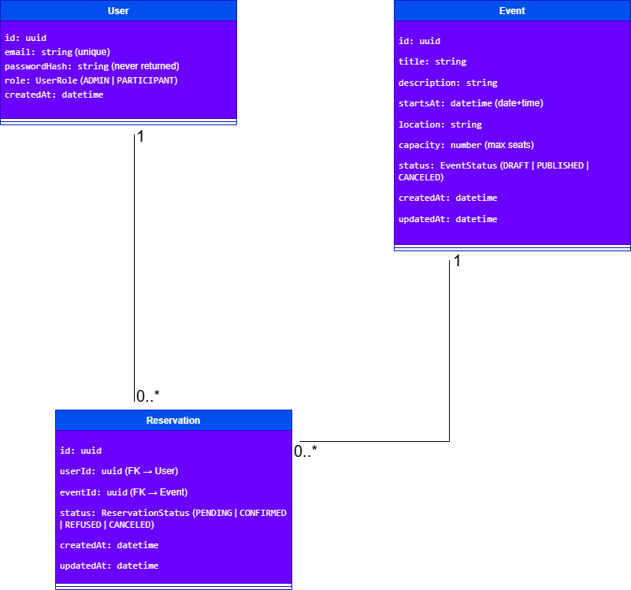

# Ledger - Event Management System

**Ledger** is a comprehensive web-based event reservation application designed to streamline the management of events, participants, and reservations. It solves the problems of manual event tracking, overbooking, and lack of real-time visibility.



---

## Features

### For Administrators
- **Event Management**: Create, edit, publish, and cancel events.
- **Capacity Tracking**: Set maximum capacity and monitor remaining seats in real-time.
- **Reservation Control**: View all reservations (by event or participant), confirm or reject them.
- **Dashboard**: Quick overview of upcoming events and occupancy stats.

### For Participants
- **Event Catalog**: Browse all published events with details (date, location, seats).
- **Reservation**: Book a seat for an event (if available and not already booked).
- **My Reservations**: View status of bookings (Pending, Confirmed, etc.).
- **Ticket Download**: Generate a PDF ticket for confirmed reservations.

---

## Technology Stack

### Backend (`ledger-api`)
-  **Framework**
-  **Database**
-  **Authentication**
- **Validation**: Global `class-validator` pipes & DTOs
- **Error Handling**: Centralized Global Exception Filter

### Frontend (`ledger-web`)
-  **Framework**
-  **Language**
- **Styling**: CSS Modules
- **State**: React Context API (`AuthContext`)
- **Rendering**: Hybrid SSR (Public Catalog) & CSR (Dashboards)

### DevOps & Infrastructure
-  **Containerization**
-  **CI/CD**

---

## Installation & Setup

### Prerequisites
- Docker & Docker Compose
- Git

### Quick Start
1. **Clone the repository**
   ```bash
   git clone https://github.com/OussamaBenoujja/ledger.git
   cd ledger
   ```

2. **Configure Environment**
   Copy the example environment file:
   ```bash
   cp .env.example .env
   ```
   *Note: The default values in `.env.example` are compatible with the Docker Compose setup.*

3. **Start the Application**
   ```bash
   docker-compose up --build
   ```
   *This will start 3 containers: `ledger_db` (Postgres), `ledger_api` (NestJS), and `ledger_web` (Next.js).*

4. **Access the App**
   - **Frontend**: [http://localhost:3001](http://localhost:3001)
   - **API / Swagger**: [http://localhost:3000/api](http://localhost:3000/api)

---

## Testing

The project includes both backend and frontend tests.

### Backend Tests
- **Unit Tests**: `npm run test` (in `ledger-api`)
- **E2E Tests**: `npm run test:e2e` (requires running DB)
  - Covers: Auth Flow, Event Creation, Reservation Lifecycle.

### Frontend Tests
- **Component & Functional Tests**: `npm test` (in `ledger-web`)
  - Covers: `Sidebar` navigation, `BookingActions` flow.

---

## Project Structure

- `ledger-api/`: NestJS Backend application.
- `ledger-web/`: Next.js Frontend application.
- `docs/`: Architecture diagrams and documentation.
- `docker-compose.yml`: Orchestration file.
- `.github/workflows/`: CI/CD Pipeline configuration.

---

## License
This project is part of a training brief and is currently Unlicensed.
