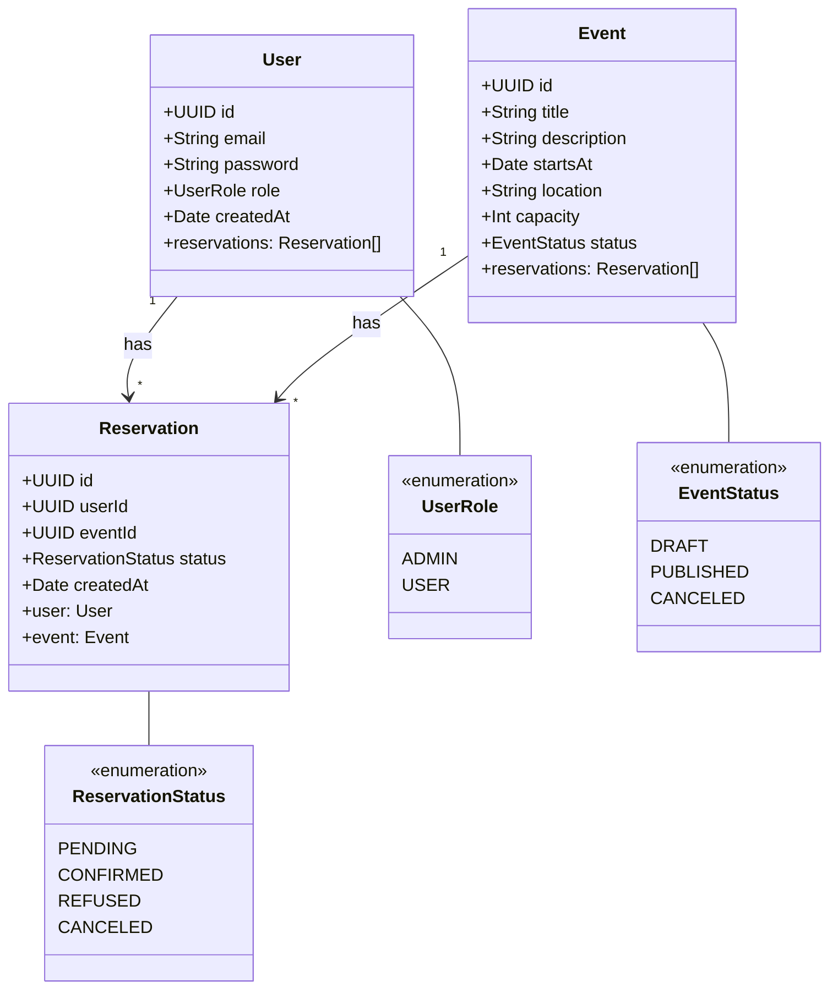
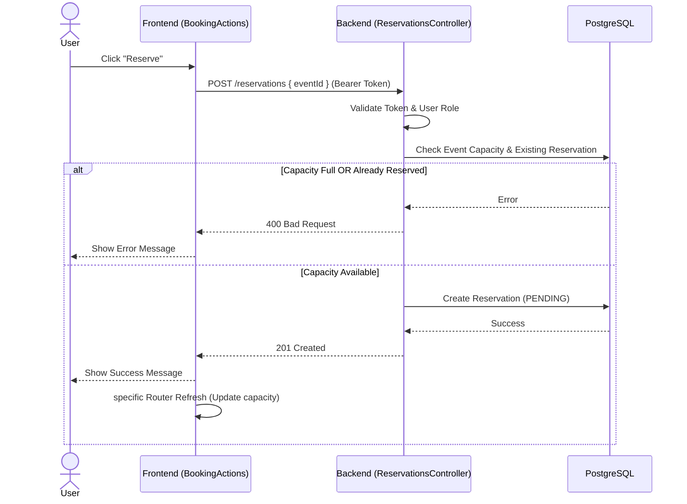

# Architecture Documentation

## 1. Global Architecture

The project follows a modular Client-Server architecture, containerized with Docker.

### Frontend (`ledger-web`)
- **Framework**: Next.js 15 (App Router)
- **Language**: TypeScript
- **Styling**: CSS Modules
- **State Management**: Context API (`AuthContext`)
- **Data Fetching**: Server Components for public data, Client Components for interactivity.

### Backend (`ledger-api`)
- **Framework**: NestJS
- **Language**: TypeScript
- **Database ORM**: TypeORM
- **Database**: PostgreSQL 13
- **Authentication**: JWT (Passport)
- **Validation**: `class-validator` / `class-transformer`

### Infrastructure
- **Docker Compose**: Orchestrates `ledger_web`, `ledger_api`, and `ledger_db`.
- **CI/CD**: GitHub Actions (Lint, Test, Build, Publish).

---

## 2. Class Diagram (Entities)

## 3. Reservation Flow Sequence

